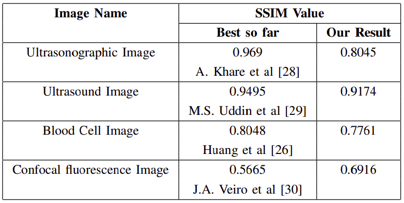
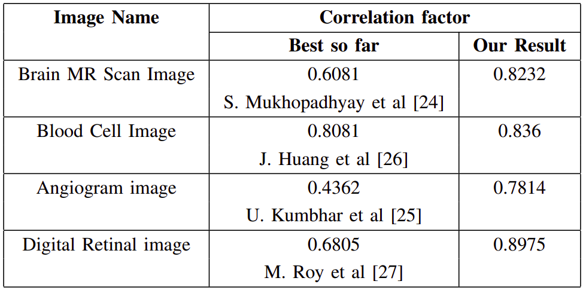

# Dark Channel Processing for Medical Image Enhancement
[Anukriti Singh](https://anukritisinghh.github.io/), [Aditi Chandra](https://www.linkedin.com/in/aditichandra18/), [Rajesh Kumar](https://drrajeshkumar.wordpress.com/), [Kuldeep Singh], [Nilanjan Dey]

[[`pdf`](https://ieeexplore.ieee.org/document/9019993/)] [[`BibTeX`](#3-citing-semask)]

This repo contains the code and result for our paper **Dark Channel Processing for Medical Image Enhancement** published at 2019 IEEE International WIE Conference on Electrical and Computer Engineering (WIECON-ECE)

## Contents
1. [Results](#1-results)
2. [Setup](#2-setup)
3. [Citing SeMask](#3-citing-semask)

## 1. Results


### Structural Similarity index (SSIM) values


### Correlation factor comparison


## 2. Setup 

## 3. Citing SeMask

```BibTeX
@INPROCEEDINGS{9019993,
  author={Singh, Anukriti and Chandra, Aditi and Kumar, Rajesh and Singh, Kuldeep and Dey, Nilanjan},
  booktitle={2019 IEEE International WIE Conference on Electrical and Computer Engineering (WIECON-ECE)}, 
  title={Dark Channel Processing for Medical Image Enhancement}, 
  year={2019},
  volume={},
  number={},
  pages={1-6},
  doi={10.1109/WIECON-ECE48653.2019.9019993}}
```

## Acknowledgements

Code is based heavily on the following repository: [Single Image Haze Removal Using Dark Channel Prior](https://it.mathworks.com/matlabcentral/fileexchange/46147-single-image-haze-removal-using-dark-channel-prior?tab=discussions).
